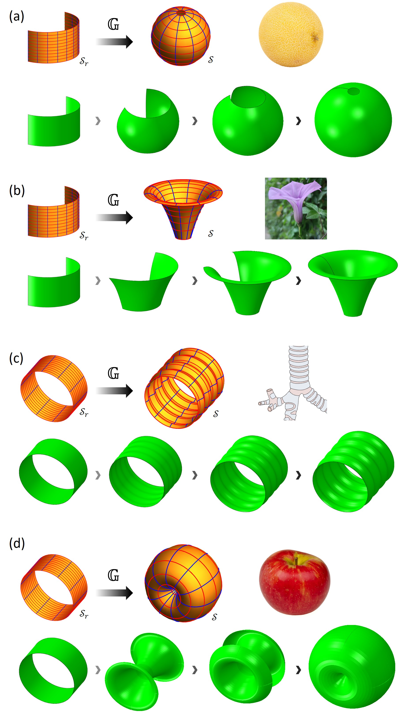
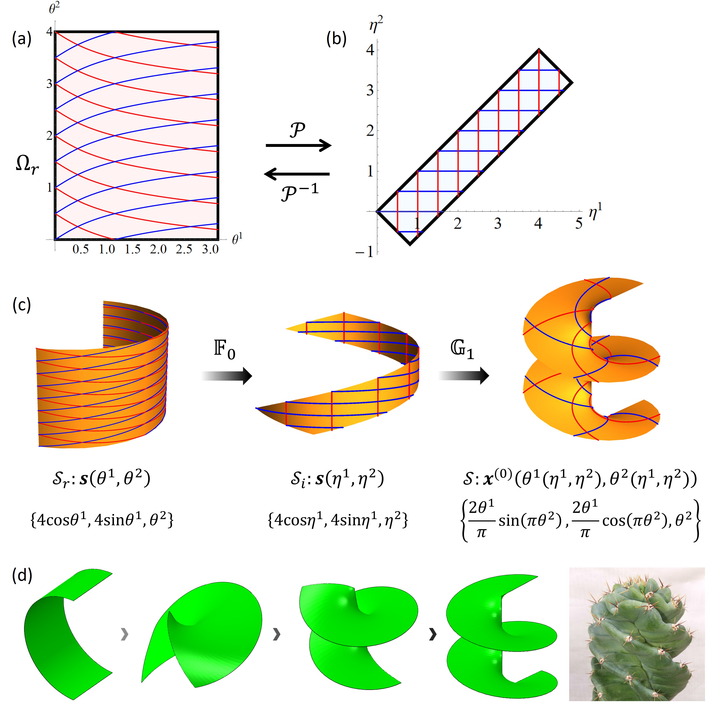
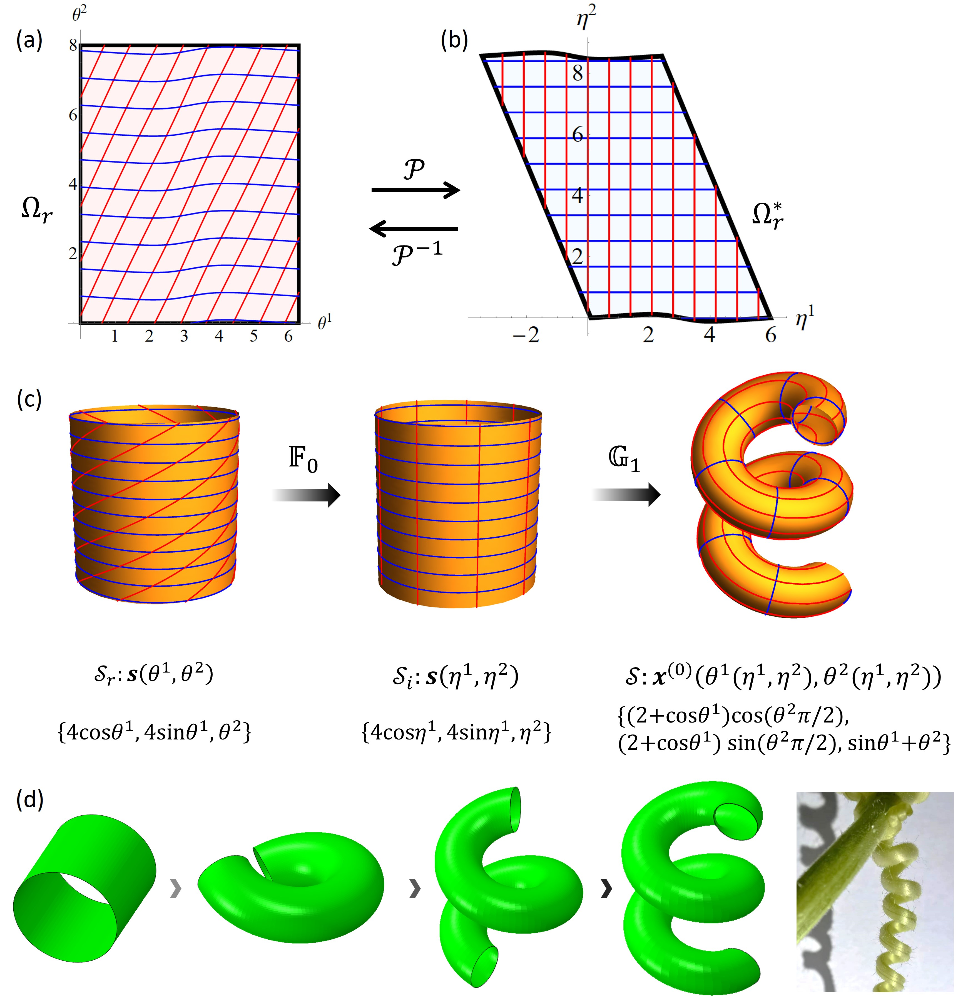

# Shape programming of incompressible hyperelastic shells

_Supplementary Abaqus models, UMAT subroutines, and visual results for differential-growth control of shells, surfaces of revolution, helical surfaces, and rods._

[](https://github.com/Jeff97/growth-of-shell/stargazers)
[](LICENSE)
[](https://doi.org/10.1016/j.ijsolstr.2023.112128)

---

## 📋 Overview

This repository accompanies the paper _A general theoretical scheme for shape-programming of incompressible hyperelastic shells through differential growth_[^1]. It provides six Abaqus reproduction cases, their Fortran UMAT subroutines, representative result figures, and a supplementary deformation movie.

The examples connect prescribed differential growth to target shell geometries ranging from surfaces of revolution to plant-inspired helices and tendrils.

## 📚 Repository map

| Path | Contents |
| --- | --- |
| [`Input files and UMAT/Example1`](Input%20files%20and%20UMAT/Example1/) | Surfaces of revolution |
| [`Input files and UMAT/Example2`](Input%20files%20and%20UMAT/Example2/) | Helical-surface example |
| [`Input files and UMAT/Example3`](Input%20files%20and%20UMAT/Example3/) | Helical-rod example |
| [`Input files and UMAT/Example4`](Input%20files%20and%20UMAT/Example4/) | Additional reproduction case |
| [`Input files and UMAT/Example5`](Input%20files%20and%20UMAT/Example5/) | Additional reproduction case |
| [`Input files and UMAT/Example6`](Input%20files%20and%20UMAT/Example6/) | Additional reproduction case |
| [`Movie 1.mp4`](Movie%201.mp4) | Simulated deformation sequences |

## 📊 Representative results


_Figure 1: Example 1 — programmed surfaces of revolution._


_Figure 2: Example 2 — mapping to a helical surface._


_Figure 3: Example 3 — mapping to a helical rod._

## 🔧 Quick start

### Prerequisites

- Abaqus/Standard with user-subroutine support
- A compatible Fortran compiler linked to Abaqus

### Run Example 1

```bat
git clone https://github.com/Jeff97/growth-of-shell.git
cd "growth-of-shell\Input files and UMAT\Example1"
abaqus job=SweetMelon user=SweetMelon.for
```

Run the command from an Abaqus Command window. Use the matching `.inp` and `.for` files when switching to another example.

> ⚠️ **Note:** These are research reproduction files and assume prior experience with Abaqus UMAT workflows. Review material parameters, boundary conditions, and compiler compatibility before use.

## 🔗 Supplementary movie

[Download or view the simulated deformation sequences](Movie%201.mp4). For large files, GitHub may require the raw-file view.

## ✍️ Citation

If this repository supports your work, please cite the paper and consider starring the repository.

> Z. Li, J. Wang, M. Hossain, and C. Kadapa, “A general theoretical scheme for shape-programming of incompressible hyperelastic shells through differential growth,” _International Journal of Solids and Structures_, vols. 265–266, 112128, 2023. https://doi.org/10.1016/j.ijsolstr.2023.112128

```bibtex
@article{Li2023GrowthShell,
  title   = {A general theoretical scheme for shape-programming of incompressible hyperelastic shells through differential growth},
  author  = {Li, Zhanfeng and Wang, Jiong and Hossain, Mokarram and Kadapa, Chennakesava},
  journal = {International Journal of Solids and Structures},
  volume  = {265--266},
  pages   = {112128},
  year    = {2023},
  doi     = {10.1016/j.ijsolstr.2023.112128}
}
```

## 🔐 License

The source code and documentation are available under the [Apache License 2.0](LICENSE). Published figures, referenced papers, and any third-party material remain subject to their respective terms.

[^1]: Z. Li et al. (2023). “A general theoretical scheme for shape-programming of incompressible hyperelastic shells through differential growth.” _International Journal of Solids and Structures_. https://doi.org/10.1016/j.ijsolstr.2023.112128
